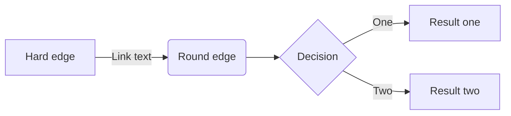
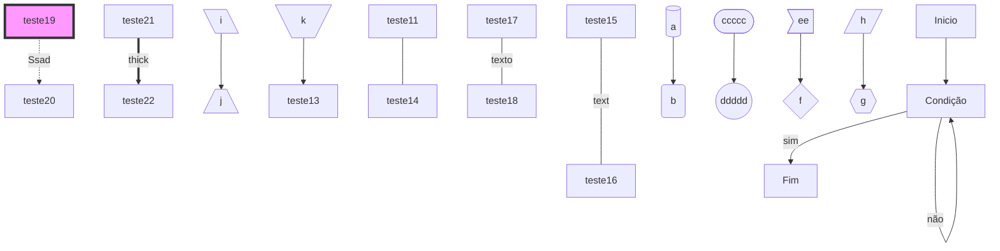

1. asd
2. 1233
3. asdas
teste de git
- asd
Consertando o issue

- [ ] Calcule a media aritmética de $n$ notas informadas pelo usuário. $\bar{x} = \frac{1}{n}\sum_{i=1}^{n}x$


- [ ] sdas 

ai vai dica: 
```c
int main

```



